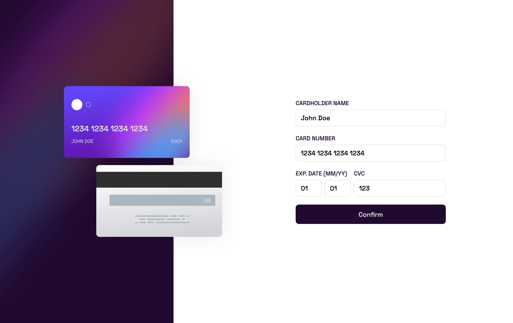
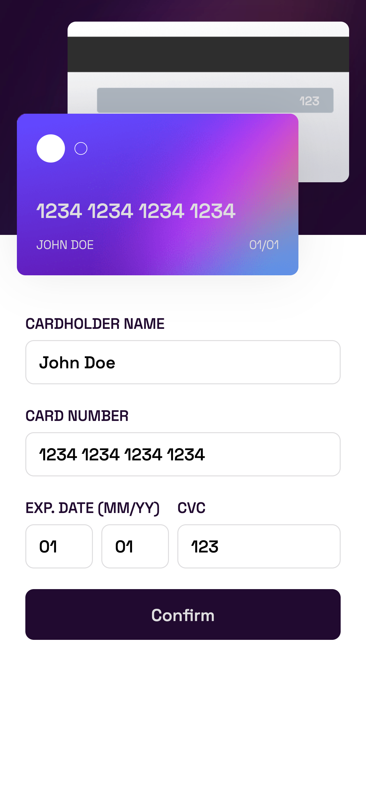

# Frontend Mentor - Interactive card details form solution

This is a solution to the [Interactive card details form challenge on Frontend Mentor](https://www.frontendmentor.io/challenges/interactive-card-details-form-XpS8cKZDWw). Frontend Mentor challenges help you improve your coding skills by building realistic projects.

## Table of contents

- [Overview](#overview)
  - [The challenge](#the-challenge)
  - [Screenshot](#screenshot)
  - [Links](#links)
- [My process](#my-process)
  - [Built with](#built-with)
  - [What I learned](#what-i-learned)
  - [Continued development](#continued-development)
  - [Useful resources](#useful-resources)
- [Author](#author)
- [Acknowledgments](#acknowledgments)

## Overview

### The challenge

Users should be able to:

- Fill in the form and see the card details update in real-time
- Receive error messages when the form is submitted if:
  - Any input field is empty
  - The card number, expiry date, or CVC fields are in the wrong format
- View the optimal layout depending on their device's screen size
- See hover, active, and focus states for interactive elements on the page

### Screenshot




### Links

- Solution URL: [GitHub Repository](https://github.com/Mariano7M/interactive-c4rd-details)
- Live Site URL: [GitHub page](https://mariano7m.github.io/interactive-c4rd-details/)

## My process

In order to complete this challenge I started creating the project by using Vite with react plugin, Then I Once I finished the project setup I started with the structure of the content in Html. After that I decided to export some of the elements in external components to keep everything more simple. With every component I was adding the style. I think having the elements on its own component lets the work to be more easy since you are only worried on the main goal of each component. I wanted to use the reducer to work with the state so I had to learn about reducers using the react documentation.

### Built with

- Semantic HTML5 markup
- CSS custom properties
- Flexbox
- Mobile-first workflow
- [React](https://reactjs.org/) - JS library

### What I learned

This time I wanted to use reacts reducer so this was the only thing I learned. I use the reacts documentation in order to use this way of state management.

```js
export function CardDetailsProvider({ children }) {
  const [cardDetails, dispatch] = useReducer(
    cardDetailsReducer,
    initialCardDetails
  );

  return (
    <CardDetailsContext.Provider value={cardDetails}>
      <CardDetailsDispatchContext.Provider value={dispatch}>
        {children}
      </CardDetailsDispatchContext.Provider>
    </CardDetailsContext.Provider>
  );
}
```

### Continued development

For state management I think I need to keep learning and practicing not only using useReducer but trying another methods like redux.

**Note: Delete this note and the content within this section and replace with your own plans for continued development.**

### Useful resources

- [React - Quick Start](https://react.dev/learn) - This is an amazing article which helped me finally understand how the components in React actually works.
- [React - Importing and Exporting Components](https://react.dev/learn/importing-and-exporting-components) - This helped me on how to import react on existing project. I used vite to initialice with just vanilla JS so I added react plugin later.
- [React - Extracting State Logic into a Reducer](https://react.dev/learn/extracting-state-logic-into-a-reducer) - This helped me on how to use the useReducer in order to manage the state.
- [Vite - Getting Started](https://vitejs.dev/guide/) - This is an amazing article which helped me understand how to create an enviroment for Javascript project.

## Author

- Frontend Mentor - [@Mariano7M](https://www.frontendmentor.io/profile/Mariano7M)
- Twitter - [@10MARINHO](https://twitter.com/10MARINHO)
